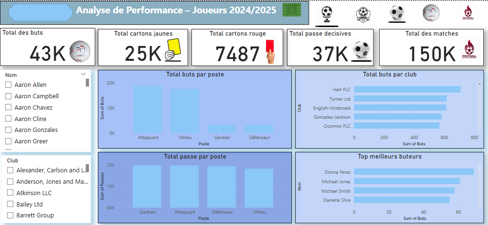

# ⚽ Tableau de Bord Power BI – Analyse de Performance des Joueurs (2024/2025)

Bienvenue sur ce projet de **visualisation interactive de données sportives** à l’aide de **Power BI**, qui présente l’analyse des performances de plus de **5 000 joueurs** 

---

## 📊 Objectif du projet

Ce tableau de bord vise à :
- Suivre les **indicateurs clés de performance (KPI)** des joueurs
- Comparer les performances par **poste**, **club**, et **joueur**
- Identifier les **joueurs les plus performants**
- Offrir une vue globale et filtrable des **statistiques de la saison**

---

## 🔍 Données utilisées

- **Nombre de buts, passes décisives**
- **Cartons jaunes & rouges**
- **Minutes jouées**
- **Position (poste), club, ligue**
- Données synthétiques générées à des fins de visualisation

---

## 📌 Indicateurs clés affichés

- 🔥 **Total des buts**  
- 🟨 **Total cartons jaunes**  
- 🟥 **Total cartons rouges**  
- 🎯 **Total des passes décisives**  
- ⏱️ **Total des matchs joués**

---

## 🧩 Visualisations incluses

- **Répartition des buts & passes par poste**
- **Top clubs selon le nombre de buts**
- **Top meilleurs buteurs**
- **Filtres interactifs** par joueur et par club
- Image de fond : **terrain de football** pour une immersion visuelle

---

## 📷 Aperçu du dashboard

  

---

## 🛠️ Outils utilisés

- **Power BI Desktop**
- Nettoyage et génération de données sous **Excel**
- Visuals natifs Power BI + personnalisation graphique

---

## 👤 Auteur

Réalisé par **OUSSEIN IBRAHIM**  
📧 Contact : [oussein001@gmail.com]  
🔗 [www.linkedin.com/in/oussein-ibrahim-0a0883339]

---

## 📁 Fichiers inclus

- `dashboard_perfommance_joueursl` → le fichier Power BI
- `README.md` → description du projet
- `image.png` → aperçu visuel du dashboard

---

Merci pour votre visite ! ⭐ N'hésitez pas à **starrer** le repo si le projet vous a plu ou à proposer des idées d’amélioration.
